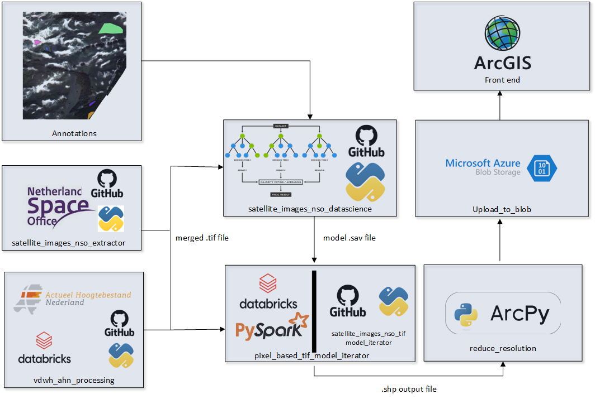

# Introduction

We as Province South Holland want to use satellite images in order to detect different surface area's of vegetation types so can we can monitor nature protected area's over time for different climate purposes.

To do this we have made a pixel based prediction model which iterates and predicts over 50cm pixels from the Superview Satellite provided by us for free by the Netherlands Space Office (NSO).

<!--- ( A [DALLE-2](https://openai.com/dall-e-2/), artistic representation of this:

)-->

We had to make a lot of custom python code ourselves for this project which hopefully can be used for other remote sensing projects at other companies or institutions as well.

We decided to split different functionalities of the python project code into different repositories in order to reduce complexity

This repository is a consolidation of all the different python repositories used the remote sensing/ objection detection in satellite images for Natura 2000 regions by Province South Holland.

Thus this repository gives a overview of all how they all come together.

# Overview.

A picture is worth more than a thousand words, so here this architecture drawing of the different components:

I will be explaining from up to down and then left to right.

## Annotations

We have tried different unsupervised models since we did not have any annotations on thus no training data to for a model.
But after several experiments we have found that with annotations and thus training data seem to lead to the best results.

And such we have made handmade annotations on satellite images ourselves for training data for the model.

They can be found here, if want to try it yourself:
https://github.com/Provincie-Zuid-Holland/satellite-images-nso-datascience/tree/main/data/annotations

## satellite_images_nso_extractor

We have found that during this project data engineering/data preprocessing took the most time and thus this package is made to easily extract satellite images from NSO.

NSO provides free satellite images from the Netherlands, but a downside is that the NSO does not provide satellite images fitted to a specific area but only a large overlapping region. This leads to a unnecessary large amount of data especially if you only want to study a smaller specific region and as such cropping is needed, which is what this package provides.

So check this repository if you want to easily download NSO satellite images:
https://github.com/Provincie-Zuid-Holland/satellite_images_nso_extractor

## vdwh_ahn_processing

A second data input we use is AHN lidar data, this is 3D height data from the Netherlands.
This can be very good to predict height in vegetation so trees for example are easy to see in this data.

We have to transform this data from 3D to 2D in order to merge it with the satellite data from the NSO so it both can be used in a model.
This repository uses Apache Spark on Databricks to transform the data from 3D to 2D, we have to spark because these computations are very expensive.

It can be found here:
https://github.com/Provincie-Zuid-Holland/vdwh_ahn_processing

## satellite_images_nso_datascience

This is the repository which holds all the different models, both old unsupervised models and the final chosen randomforest model, for the remote sensing project.

It also holds the annotation data and the code to extract the RGBIH values from satellite images based on these annotations thus creating training data for the model.

Find it on the link here:
https://github.com/Provincie-Zuid-Holland/satellite-images-nso-datascience

## pixel_based_tif_model_iterator

Since a average satellite image that we use contains around 3 billion pixels that we have to iterate over we have written custom python code to run the model in a distributed way.

3 Billion pixels is too much data to hold in memory so we divide the satellite images into multiple parts, these parts in turn get distributed across the cluster.

It contains pyspark code to iterate the model on a disturbed cluster in a data bricks environment.

Or using python multiprocessing, which uses up all your cpu's and thus freezes your pc, when running locally

Find it here:
https://github.com/Provincie-Zuid-Holland/satellite_images_nso_tif_model_iterator

## Arcgis pipeline

We have a custom pipeline which deploys the models outcomes to our arcgis dashboard environment.

## Province of South-Holland Workflow

Note that the following workflow assumes:

- The ahn data for the \<area-of-interest\> has already been preprocessed (see [vdwh_ahn_preprocessing](https://github.com/Provincie-Zuid-Holland/vdwh_ahn_processing)) and is located at \<ahn-file-path\>.
- A Random Forest model has already been trained for the \<area-of-interest\> and is located at \<filepath-to-existing-model.sav\>.

These are the steps the Province of South-Holland takes to go from scratch to an anotated shape file of an area:

1. Download the geojson file of the area of interest from the `pzh-blob-satelliet` blob storage in folder `satellite-images-nso/natura2000-geojson-gebieden/`. Place it locally in the \<local-geojson-folder\>.
   - Note that files starting with `natura2000` in this folder take precedence as they are more accurate
2. Setup the [satellite_images_nso_extractor](https://github.com/Provincie-Zuid-Holland/satellite_images_nso_extractor) repository.
3. Open `src/nso_notebook_example.ipynb` in satellite_images_nso_extractor and change the second cell as follows:
   - nso_username and nso_password to the correct credentials
   - path_geojson = \<local-geojson-folder\>/\<geojson-file-name\>
   - height_band_filepath = \<ahn-file-path\>
   - output_path = \<local-satellite-images-folder\>
   - links_must_contain = ["SV", "50cm", "RGBI", "\<year-of-interest\>"]
4. Run all the cells before "Normalize Landsat Image" in the notebook `src/nso_notebook_example.ipynb`.
5. Upload the resulting <cropped_ndvi_height_tif_filepath> to `pzh-blob-satelliet` blob storage to folder `satellite-images-nso/50cm/\<area-of-interest\>`
6. Setup the [satellite-images-nso-data-science](https://github.com/Provincie-Zuid-Holland/satellite-images-nso-datascience) repository.
7. In `scalers_make_run/run_make_scalers_normalize.ipynb` change the second cell so that
   - folder_path = \<local-satellite-images-folder\>
8. Run `scalers_make_run/run_make_scalers_normalize.ipynb`. The resulting files will appear in `\<local-satellite-images-nso-data-science-folder\>/scalers`.
9. Setup the [satellite_images_nso_tif_iterator](https://github.com/Provincie-Zuid-Holland/satellite_images_nso_tif_model_iterator) repository.
   - Note that this requires executing `pip install .` in the [satellite-images-nso-data-science](https://github.com/Provincie-Zuid-Holland/satellite-images-nso-datascience) repository.
10. Set up settings.py as instructed in the README, where:
    - MODEL_PATH = \<filepath-to-existing-model.sav\>
    - TIF_FILE = \<local-satellite-images-filepath\>
    - OUTPUT_PATH = \<model-output-path\>
    - OUTPUT_FILENAME = \<output-filename.shp or .geojson\>
    - PATH_TO_SCALER = "\<local-satellite-images-nso-data-science-folder\>/scalers"
11. Run `example_iterator.py`
    - Note you might need to change the `parts` variable here, to optimize the speed of execution. This will determine the size of the chunk processed.
    - This will likely take quite some time. (in the order of hours)
12. Your labelled polygons can now be found in '\<model-output-path\>/\<output-filename.shp or .geojson\>' and visualised using a GIS tool.

# Author

Michael de Winter

# Contact

Contact us at vdwh@pzh.nl
